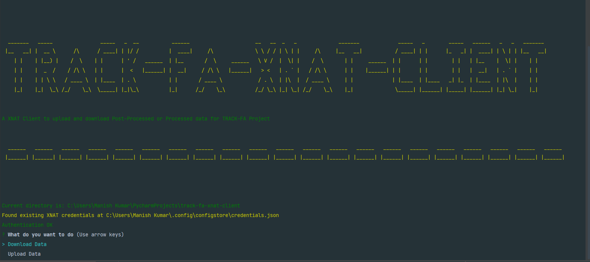
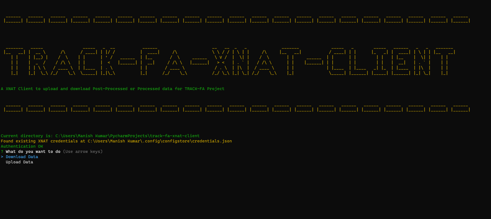
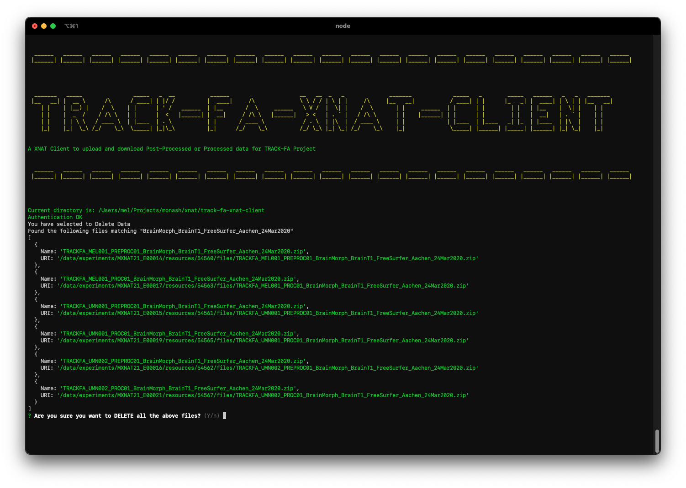

# TRACK-FA XNAT Client


XNAT client built for TRACK-FA project to download/upload data to XNAT. 

This XNAT client is built using Node.js and uses XNAT rest api.

## Running TRACK-FA XNAT Client

## Uploading Data

TRACK-FA XNAT client can be used to upload processed and pre-processed data to XNAT. 
This client assumes that the name of the zip file to be uploaded will be in the form PROJECTID_SUBJECTID_{PREPROC/PROC}_ProcessingSoftware.zip




## Downloading Data



## Deleting Data

Track-FA XNAT client can delete all files for a specific pipeline by running with the following parameters:
```
track-fa-xnat-client n -h https://xnat.monash.edu/ -u xnat_username -p xnat_password -m "Delete Data" -o TRACKFA  -P "Matching_Pipeline_Name"
```
It will then find all files with the matching pipeline name and list them on screen before confirmation of the delete.

